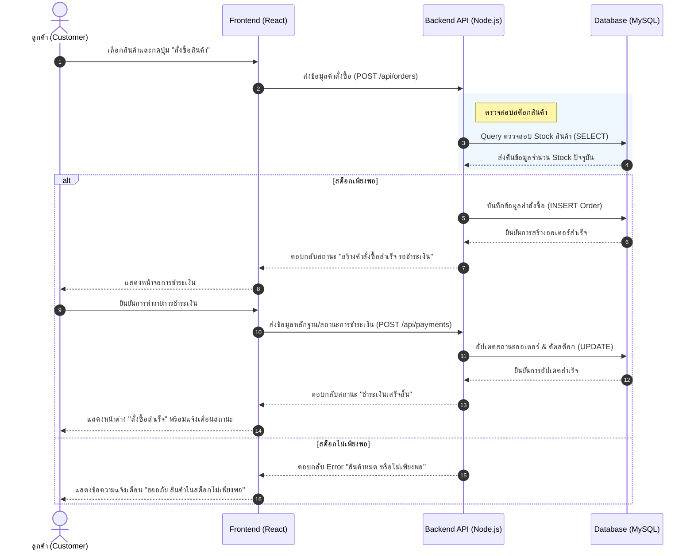
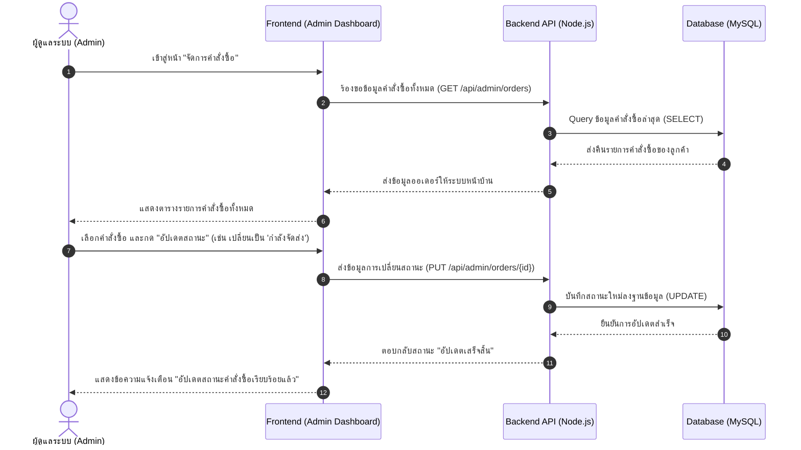
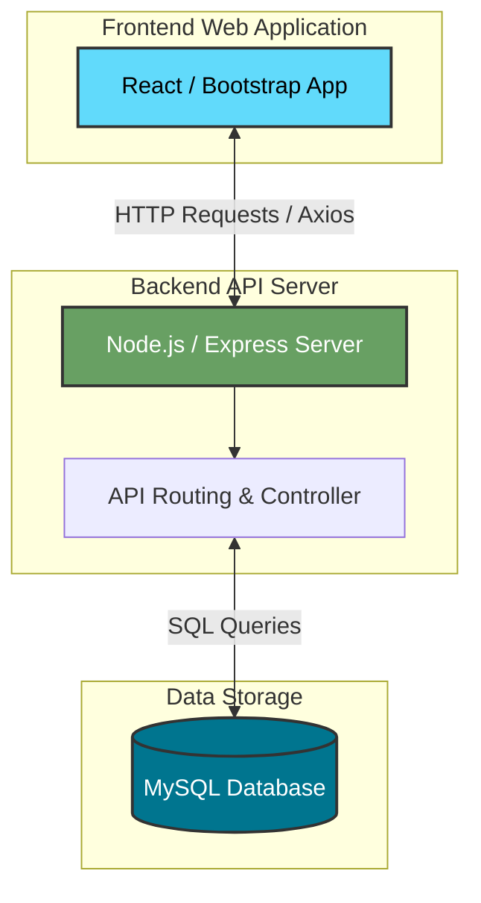

#  PhoneHub (โฟนฮับ)
### แพลตฟอร์ม E-Commerce สำหรับจำหน่ายสมาร์ทโฟน
<!-- > **รายวิชา:** CSI204 ดิจิทัลแพลตฟอร์มสำหรับพัฒนาซอฟต์แวร์ (ภาคฤดูร้อน/2568)   -->
<!-- > **ภาควิชา:** Department of Computer Science and Software Development Innovation -->

---

## 1.สมาชิกกลุ่ม

| ลำดับ | รหัสนักศึกษา | ชื่อ-สกุล | หน้าที่รับผิดชอบ |
| :---: | :---: | :--- | :--- |
| 1 | 67163280 | คณิศร์ จำจด | PM, Backend Developer |
| 2 | 67163975 | ภูบดินทร์ เรืองวิลัย | Frontend Developer, Tester |
| 3 | 67142294 | นิชกานต์ คำสุข | Frontend Developer |
| 4 | 67167379 | ชนาวีร์ ใยโพธิ์ทอง | UX/UI Designer |

---
## สารบัญ
- [ สมาชิกกลุ่ม](#members)
- [ หลักการและเหตุผล (Rationale)](#rationale)
- [ วัตถุประสงค์ (Objectives)](#objectives)
- [ ผลลัพธ์ที่คาดว่าจะได้รับ (Expected Outcomes)](#outcomes)
- [ การวิเคราะห์และออกแบบระบบ (Analysis & Design)](#analysis)
- [ ขอบเขตระบบ (System Scope)](#scope)
- [ เทคโนโลยีและเครื่องมือที่ใช้ (Tools & Technologies)](#tools)
- [ User Personas (กลุ่มผู้ใช้งานเป้าหมาย)](#personas)
- [ แผนการดำเนินงาน 4 สัปดาห์ (Work Plan)](#workplan)
- [ แผนภาพ Use Case Diagram](#usecase)
- [ แผนภาพคลาส (Class Diagram)](#classdiagram)
- [ แผนภาพลำดับขั้นตอน (Sequence Diagram)](#sequence)
- [ แผนผังโครงสร้างระบบ (System Architecture)](#architecture)
---

## 2.หลักการและเหตุผล (Rationale)
ในยุคปัจจุบัน โทรศัพท์มือถือและอุปกรณ์ไอทีไม่ได้เป็นเพียงแค่เครื่องมือสื่อสาร แต่เป็นปัจจัยสำคัญในการดำรงชีวิต การทำงาน และการทำธุรกรรมต่าง ๆ ส่งผลให้ตลาดมีการเติบโตและเปลี่ยนแปลงอย่างรวดเร็ว อย่างไรก็ตาม การบริหารจัดการร้านค้าหรือระบบจำหน่ายโทรศัพท์มือถือในปัจจุบันยังคงประสบปัญหาสำคัญหลายประการ ทีมพัฒนาจึงได้เล็งเห็นถึงโอกาสในการสร้างแพลตฟอร์มดิจิทัลที่มีประสิทธิภาพเพื่อตอบโจทย์ทั้งผู้ซื้อและผู้ขาย

## 3.วัตถุประสงค์ (Objectives)
1. เพื่อศึกษา วิเคราะห์ และออกแบบระบบบริหารจัดการการจำหน่ายโทรศัพท์มือถือที่เหมาะสมกับผู้ใช้งาน
2. เพื่อศึกษาและพัฒนาเว็บไซต์ E-Commerce สำหรับจำหน่ายสมาร์ทโฟนรุ่นยอดนิยมที่ใช้งานง่าย
3. เพื่อศึกษาและประยุกต์ใช้ Tools ต่าง ๆ ในการพัฒนาเว็บไซต์ให้เกิดประสิทธิภาพสูงสุด

## 4.ผลลัพธ์ที่คาดว่าจะได้รับ (Expected Outcomes)
* ลูกค้าสามารถเข้าถึงและสั่งซื้อสมาร์ทโฟนได้อย่างสะดวก มั่นใจในความถูกต้อง และมีระบบจัดอันดับมือถือยอดนิยมเพื่อช่วยประกอบการตัดสินใจ
* ระบบรองรับการสั่งซื้อสินค้า และสามารถติดตามสถานะคำสั่งซื้อได้อย่างมีประสิทธิภาพ
* ผู้ดูแลระบบสามารถจัดการข้อมูลสินค้า คำสั่งซื้อ และสินค้าคงคลังได้ง่าย พร้อม Dashboard สำหรับติดตามภาพรวม
* ระบบมีความปลอดภัย โปร่งใส และสามารถตรวจสอบการทำงานได้อย่างต่อเนื่อง
* ระบบสามารถปรับปรุงและขยายฟีเจอร์เพิ่มเติมได้ในอนาคต เพื่อรองรับจำนวนผู้ใช้งานที่เพิ่มขึ้น

---

## 5.การวิเคราะห์และออกแบบระบบ (Analysis & Design)

###  ผู้ใช้งานในระบบ (Actors)
* **ลูกค้า (Customer):** เข้าใช้งานระบบเพื่อเลือกซื้อสินค้า ดูรายละเอียดสินค้า สั่งซื้อสินค้าผ่านระบบตะกร้า ชำระเงิน และติดตามสถานะคำสั่งซื้อ
* **ผู้ดูแลระบบ (Administrator):** จัดการข้อมูลสินค้า สต็อกสินค้า จัดการคำสั่งซื้อ ดูรายงานสรุปยอดขาย (Dashboard) และดูแลระบบโดยรวม

### ความสามารถหลักของระบบ (Main Functions)
1. **ระบบจัดอันดับมือถือยอดนิยม:** แสดงผลสมาร์ทโฟนรุ่นที่ได้รับความสนใจสูง
2. **ระบบซื้อสินค้า:** เลือกสินค้าลงตะกร้า ชำระเงิน และจัดการคำสั่งซื้อ
3. **ระบบติดตามสถานะคำสั่งซื้อ:** ตรวจสอบขั้นตอนการจัดส่งสินค้าได้แบบเรียลไทม์
4. **ระบบการจัดการสินค้า:** เพิ่ม ลบ แก้ไข ข้อมูลสมาร์ทโฟน สเปค และราคา
5. **ระบบจัดการผู้ใช้งาน:** ระบบสมัครสมาชิก เข้าสู่ระบบ และการจัดการสิทธิ์

---

## 6.ขอบเขตระบบ (System Scope)

###  ลูกค้า (Customer)
* สมัครสมาชิกและเข้าสู่ระบบ (Login / Register)
* ค้นหาสินค้า
* ดูรายละเอียดสินค้า
* เพิ่มสินค้าในตะกร้าสินค้า
* สั่งซื้อสินค้าและชำระเงิน
* ติดตามสถานะคำสั่งซื้อ

###  ผู้ดูแลระบบ (Admin)
* ระบบจัดการ User 
* การจัดการข้อมูลสินค้าและสต็อกสินค้า
* ระบบจัดการคำสั่งซื้อของลูกค้า
* ระบบ Report และ Dashboard สรุปข้อมูลสำคัญ (ยอดขาย, สินค้าขายดี, และภาพรวม)

---

##	7. เทคโนโลยีและเครื่องมือที่ใช้ (Tools & Technologies)

* **Frontend:** React, Bootstrap, JavaScript
* **Backend:** Node.js
* **Database:** MySQL
* **Design Tools:** Figma, Draw.io
* **Version Control:** Git, GitHub
* **Testing Tools:** Postman, Manual Testing

---

##  8.User Personas (กลุ่มผู้ใช้งานเป้าหมาย)

###  Persona 1: ลูกค้า (Customer)
**"ผู้ใช้งานที่ต้องการความสะดวก มั่นใจในข้อมูล และอยากรู้สถานะสินค้าของตัวเองตลอดเวลา"**

* **ชื่อ:** นนท์ (อายุ 21 ปี, นักศึกษา)
* **ความเชี่ยวชาญด้านเทคโนโลยี:** ปานกลาง - สูง (คุ้นเคยกับการซื้อของออนไลน์)
* **เป้าหมาย (Goals):**
  * ต้องการซื้อมือถือเครื่องใหม่ในราคาที่คุ้มค่าและได้ของแท้แน่นอน
  * สามารถค้นหาสมาร์ทโฟนรุ่นที่เล็งไว้ และดูรายละเอียดสเปคได้อย่างชัดเจน
  * ต้องการขั้นตอนการชำระเงินที่ง่าย ปลอดภัย และไม่ซับซ้อน
  * สามารถเช็คสถานะการจัดส่งได้แบบเรียลไทม์ว่าของถึงไหนแล้ว
* **พฤติกรรม (Behaviors):**
  * มักจะค้นหาข้อมูลและเปรียบเทียบสเปคในใจก่อนเข้ามาที่เว็บ
  * ชอบหยิบสินค้าใส่ตะกร้าไว้ก่อนเพื่อดูยอดรวม แล้วค่อยตัดสินใจจ่ายเงินทีหลัง
  * เมื่อสั่งซื้อแล้ว จะเข้ามาเช็คสถานะคำสั่งซื้อ (Order Tracking) บ่อยครั้ง
* **ปัญหาที่มักพบ (Pain Points):**
  * เว็บทั่วไปมักบอกรายละเอียดสเปคสินค้าไม่ครบถ้วน หรือดูยาก
  * ระบบชำระเงินดูไม่น่าเชื่อถือ ทำให้ไม่กล้าโอนเงินจำนวนมาก
  * สั่งซื้อไปแล้วแต่ร้านไม่ยอมอัปเดตสถานะการจัดส่ง ทำให้เกิดความกังวล

---

### Persona 2: ผู้ดูแลระบบ (Admin)
**"ผู้ใช้งานที่ต้องการความรวดเร็วในการจัดการหลังบ้าน และต้องการเห็นภาพรวมของธุรกิจในหน้าเดียว"**

* **ชื่อ:** พิมพ์ (อายุ 30 ปี, ผู้จัดการร้านมือถือ / แอดมินดูแลเว็บไซต์)
* **ความเชี่ยวชาญด้านเทคโนโลยี:** ปานกลาง (ใช้งานโปรแกรมจัดการร้านค้าได้ดี)
* **เป้าหมาย (Goals):**
  * สามารถเพิ่ม แก้ไข หรือลบข้อมูลสมาร์ทโฟน (เช่น รุ่น, สี, ความจุ, ราคา) ได้อย่างรวดเร็ว
  * ตรวจสอบคำสั่งซื้อใหม่ที่เข้ามา และเปลี่ยนสถานะ (เช่น รอชำระเงิน -> กำลังจัดส่ง) ได้ทันที
  * ดูสรุปยอดขายรวม จำนวนออเดอร์ และสินค้าคงเหลือ ผ่านหน้า Dashboard ได้อย่างรวดเร็วโดยไม่ต้องคำนวณเอง
* **พฤติกรรม (Behaviors):**
  * ล็อกอินเข้าสู่ระบบหลังบ้าน (Back-office) เป็นสิ่งแรกของวันเพื่อเช็คออเดอร์
  * คอยอัปเดตสต็อกสินค้าทันทีเมื่อมีสินค้าล็อตใหม่เข้ามา
* **ปัญหาที่มักพบ (Pain Points):**
  * สมาร์ทโฟนมีหลายรุ่น หลายสี หลายความจุ ทำให้การจัดการสต็อกแบบแมนนวลเกิดความผิดพลาดได้ง่าย
  * การตามเช็คสลิปหรือสถานะการจ่ายเงินของลูกค้าแต่ละคนใช้เวลานาน
  * ไม่มีระบบสรุปยอดขาย ทำให้ไม่รู้ว่าช่วงนี้มือถือรุ่นไหนกำลังขายดี
---

## 9.แผนการดำเนินงาน 4 สัปดาห์ (Work Plan)

### **สัปดาห์ที่ 1: วิเคราะห์และออกแบบระบบ (Planning & Design)
* รวบรวมและวิเคราะห์ความต้องการของระบบ (Requirement Analysis)
* ออกแบบสถาปัตยกรรมระบบและโครงสร้างฐานข้อมูล MySQL
* ออกแบบหน้าจอผู้ใช้งาน UX/UI (Wireframes & Prototype) ด้วย Figma
* แบ่งหน้าที่และวางแผนการทำงานในทีม

### **สัปดาห์ที่ 2: พัฒนาระบบส่วนหลัก (Core Development) 
* ติดตั้งและตั้งค่าโครงสร้าง Frontend (React) และ Backend (Node.js)
* พัฒนาระบบ Authentication (Login / Register)
* พัฒนาระบบแสดงรายละเอียดสินค้า ค้นหา และจัดการสต็อก (Product Management)

### **สัปดาห์ที่ 3: พัฒนาระบบซื้อขายและแอดมิน (E-Commerce & Admin) 
* พัฒนาระบบตะกร้าสินค้า สั่งซื้อ และการชำระเงิน
* พัฒนาระบบติดตามสถานะคำสั่งซื้อ (Order Tracking)
* พัฒนาระบบจัดการคำสั่งซื้อสำหรับผู้ดูแลระบบ
* พัฒนาระบบ Report และ Dashboard สรุปข้อมูล

### **สัปดาห์ที่ 4: เก็บรายละเอียด ทดสอบ และส่งมอบ (Testing & Delivery) 
* พัฒนาฟีเจอร์ส่วนที่เหลือ (ระบบจัดการ User และจัดอันดับมือถือยอดนิยม)
* ทดสอบการทำงานของระบบโดยรวม (System Testing & Bug Fixing)
* จัดทำเอกสารประกอบโครงงาน (README & Documentation)
* เตรียมความพร้อมสำหรับการนำเสนอโปรเจกต์ (Final Presentation) 
---

## 10.Diagram
### Use Case Diagram

---

## 11.Class Diagram
แสดงโครงสร้างของระบบ PhoneHub รวมถึงแอตทริบิวต์ (Attributes), เมธอด (Methods) และความสัมพันธ์ระหว่างคลาส:

---

## 12.Sequence Diagram
 ### 12.1 Customer แสดงลำดับขั้นตอนการทำงานของระบบในกระบวนการหลัก: **การสั่งซื้อสินค้าและการชำระเงิน (Checkout Process)**

---
### 12.2 Admin กระบวนการฝั่งผู้ดูแลระบบ: การจัดการและอัปเดตสถานะคำสั่งซื้อ (Order Management)

---

## 13.System Architecture
สถาปัตยกรรมของเว็บแอปพลิเคชันแบ่งออกเป็น 3 ส่วนหลัก (3-Tier Architecture) ตามแผนภาพด้านล่างนี้:

---

## 14.ตารางผลการทดสอบระบบ (User Acceptance Testing - UAT)

###  ฝั่งลูกค้า (Customer)

| รหัสการทดสอบ | รายการทดสอบ | สถานะการทดสอบ | ปัญหา / ข้อผิดพลาด | รายละเอียดของปัญหา |
| :---: | :--- | :--- | :--- | :--- |
| UAT-C01 | Login / Register  | ✅ ผ่าน ⬜ ไม่ผ่าน | ⬜ ระบบทำงานไม่ตรงตามความต้องการ ⬜ ปัญหาเกี่ยวกับหน้าจอและการใช้งาน ⬜ ปัญหาเกี่ยวกับข้อมูล | |
| UAT-C02 | ระบบค้นหา  | ✅ ผ่าน ⬜ ไม่ผ่าน | ⬜ ระบบทำงานไม่ตรงตามความต้องการ ⬜ ปัญหาเกี่ยวกับหน้าจอและการใช้งาน ⬜ ปัญหาเกี่ยวกับข้อมูล | |
| UAT-C03 | ระบบแสดงรายละเอียดสินค้า  | ✅ ผ่าน ⬜ ไม่ผ่าน | ⬜ ระบบทำงานไม่ตรงตามความต้องการ ⬜ ปัญหาเกี่ยวกับหน้าจอและการใช้งาน ⬜ ปัญหาเกี่ยวกับข้อมูล | |
| UAT-C04 | ระบบตะกร้าสินค้า  | ✅ ผ่าน ⬜ ไม่ผ่าน | ⬜ ระบบทำงานไม่ตรงตามความต้องการ ⬜ ปัญหาเกี่ยวกับหน้าจอและการใช้งาน ⬜ ปัญหาเกี่ยวกับข้อมูล | |
| UAT-C05 | ระบบสั่งซื้อสินค้า  | ✅ ผ่าน ⬜ ไม่ผ่าน | ⬜ ระบบทำงานไม่ตรงตามความต้องการ ⬜ ปัญหาเกี่ยวกับหน้าจอและการใช้งาน ⬜ ปัญหาเกี่ยวกับข้อมูล | |
| UAT-C06 | ระบบชำระเงิน  | ✅ ผ่าน ⬜ ไม่ผ่าน | ⬜ ระบบทำงานไม่ตรงตามความต้องการ ⬜ ปัญหาเกี่ยวกับหน้าจอและการใช้งาน ⬜ ปัญหาเกี่ยวกับข้อมูล | |
| UAT-C07 | ระบบติดตามสถานะคำสั่งซื้อ ) | ✅ ผ่าน ⬜ ไม่ผ่าน | ⬜ ระบบทำงานไม่ตรงตามความต้องการ ⬜ ปัญหาเกี่ยวกับหน้าจอและการใช้งาน ⬜ ปัญหาเกี่ยวกับข้อมูล | |

---

### ฝั่งผู้ดูแลระบบ (Administrator)

| รหัสการทดสอบ | รายการทดสอบ | สถานะการทดสอบ | ปัญหา / ข้อผิดพลาด | รายละเอียดของปัญหา |
| :---: | :--- | :--- | :--- | :--- |
| UAT-A01 | ระบบจัดการ User  | ⬜ ผ่าน ❌ ไม่ผ่าน | ❌ ระบบทำงานไม่ตรงตามความต้องการ ⬜ ปัญหาเกี่ยวกับหน้าจอและการใช้งาน ❌ ปัญหาเกี่ยวกับข้อมูล | แอดมินยังไม่สามารถเปลี่ยนสิทธิ์ (Role) หรือระงับบัญชีผู้ใช้งานได้ |
| UAT-A02 | การจัดการข้อมูลสินค้า และ จัดการสินค้า | ✅ ผ่าน ⬜ ไม่ผ่าน | ⬜ ระบบทำงานไม่ตรงตามความต้องการ ⬜ ปัญหาเกี่ยวกับหน้าจอและการใช้งาน ⬜ ปัญหาเกี่ยวกับข้อมูล | |
| UAT-A03 | ระบบจัดการคำสั่งซื้อ  | ✅ ผ่าน ⬜ ไม่ผ่าน | ⬜ ระบบทำงานไม่ตรงตามความต้องการ ⬜ ปัญหาเกี่ยวกับหน้าจอและการใช้งาน ⬜ ปัญหาเกี่ยวกับข้อมูล | |
| UAT-A04 | ระบบ Report และ แดชบอร์ด  | ✅ ผ่าน ⬜ ไม่ผ่าน | ⬜ ระบบทำงานไม่ตรงตามความต้องการ ⬜ ปัญหาเกี่ยวกับหน้าจอและการใช้งาน ⬜ ปัญหาเกี่ยวกับข้อมูล | |
---
### สรุปผลการทดสอบ User Acceptance Testing (UAT) จำนวน Test Case ทั้งหมด 12 รายการ

**อัตราการผ่านการทดสอบ (Success Rate Metrics)**
- จำนวนตัวเคสการทดสอบรวมทั้งหมด: 11 รายการ
- จำนวนเคสที่ผ่านการทดสอบ (Pass): 10 รายการ
- จำนวนเคสที่ไม่ผ่านการทดสอบ (Fail): 1 รายการ

**เปอร์เซ็นต์ความสำเร็จในการผ่านรอบทดสอบ: 90.91%**

 - ซึ่งจากผลการทดสอบพบว่าฟังก์ชันพื้นฐานของระบบส่วนใหญ่ สามารถทำงานได้ตามที่ออกแบบไว้ได้อย่างสมบูรณ์ ไม่พบข้อผิดพลาดในกระบวนการสำคัญ เช่น ระบบตะกร้าสินค้า การสั่งซื้อ การชำระเงิน และการจัดการข้อมูลสินค้า อย่างไรก็ตาม ยังคงพบข้อผิดพลาดในฟังก์ชันบางส่วน ได้แก่ ระบบจัดการสิทธิ์ผู้ใช้งาน (User Management)
---
### ตารางสรุปปัญหาที่พบ
อ้างอิงจากผลการทดสอบเฉพาะรายการที่ไม่ผ่าน (UAT-A01)

| Issue ID | รายละเอียดปัญหา | ประเภทของปัญหา | ระดับความสำคัญ |
| :---: | :--- | :--- | :---: |
| ISS-002 | **(UAT-A01)** แอดมินยังไม่สามารถเปลี่ยนสิทธิ์ (Role) หรือระงับบัญชีผู้ใช้งานได้ | ระบบทำงานไม่ตรงตามความต้องการ  และ ปัญหาเกี่ยวกับข้อมูล | High |
